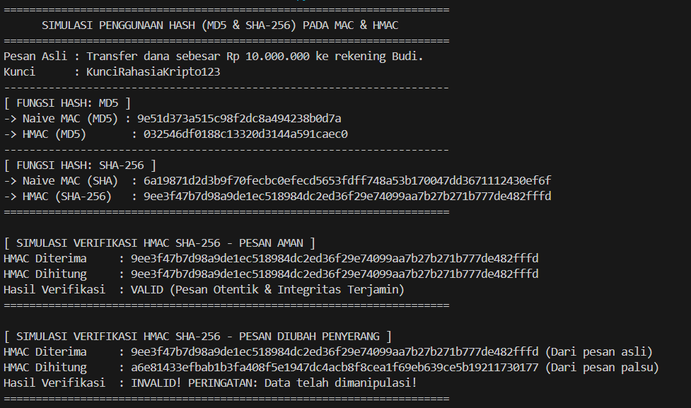

# Simulasi Penggunaan Hash (MD5 & SHA-256) pada MAC & HMAC

Proyek ini adalah simulasi sederhana untuk memahami konsep **Message Authentication Code (MAC)** dan **Hash-based Message Authentication Code (HMAC)** menggunakan fungsi hash **MD5** dan **SHA-256** dalam bahasa pemrograman Python. Proyek ini dibuat untuk memenuhi tugas mata kuliah Kriptografi.

---

## 👥 Anggota Kelompok 1

Berikut adalah daftar anggota kelompok 1 yang berkontribusi dalam pembuatan proyek ini:

1. **[Rasyid Oktavian]** - [2306045]
2. **[Ai Nur Azizah]** - [2306077]
3. **[Asyifa Azsma Homsatiun]** - [2306071]
4. **[Muhammad Daffa Adzdzikra D]** - [2306082]

---

## 📖 Deskripsi Teori Singkat

### 1. Naive MAC (Message Authentication Code Sederhana)

Pada metode _Naive MAC_, kode autentikasi dihitung dengan cara menggabungkan kunci rahasia ($K$) langsung dengan pesan ($M$) lalu dimasukkan ke fungsi hash:
$$\text{MAC}(K, M) = \text{Hash}(K \mathbin{\Vert} M)$$

> [!WARNING] > **Kelemahan Keamanan:** Metode ini rentan terhadap **Length Extension Attack**. Penyerang dapat menambahkan data baru di akhir pesan asli tanpa perlu mengetahui kunci rahasianya, lalu menghitung nilai hash baru yang valid.

### 2. HMAC (Hash-based Message Authentication Code)

HMAC mengatasi kelemahan _Length Extension Attack_ dengan menggunakan mekanisme _double-hashing_ yang melibatkan dua _padding_ internal, yaitu **ipad** (inner padding) dan **opad** (outer padding):
$$\text{HMAC}(K, M) = \text{Hash}\big((K \oplus opad) \mathbin{\Vert} \text{Hash}((K \oplus ipad) \mathbin{\Vert} M)\big)$$

Protokol ini telah distandardisasi secara global (RFC 2104) dan terbukti aman secara matematis untuk menjamin integritas data dan otentikasi asal pesan.

---

## 🛠️ Penjelasan Kode Program (`kode.py`)

Kode program dalam [kode.py](file:///d:/KAMPUS/SEMESTER%206/KRIPTOGRAFI/MAC%20&%20HMAC/kode.py) dibagi menjadi beberapa bagian utama:

### 1. Fungsi Utama

- **`hitung_naive_mac(key, message, algorithm)`**
  Menghitung MAC sederhana dengan menggabungkan kunci (`key`) dan pesan (`message`) kemudian memprosesnya dengan algoritma hash (`md5` atau `sha256`).

  ```python
  def hitung_naive_mac(key: bytes, message: bytes, algorithm: str) -> str:
      hasher = hashlib.new(algorithm)
      hasher.update(key + message)
      return hasher.hexdigest()
  ```

- **`hitung_hmac(key, message, algorithm)`**
  Menghitung HMAC yang aman menggunakan pustaka bawaan Python `hmac`. Ini mengimplementasikan standar RFC 2104 secara aman.
  ```python
  def hitung_hmac(key: bytes, message: bytes, algorithm: str) -> str:
      digestmod = getattr(hashlib, algorithm)
      h = hmac.new(key, message, digestmod=digestmod)
      return h.hexdigest()
  ```

### 2. Skenario Simulasi

Program menjalankan simulasi dengan parameter berikut:

- **Pesan Asli:** `"Transfer dana sebesar Rp 10.000.000 ke rekening Budi."`
- **Kunci Rahasia:** `"KunciRahasiaKripto123"`

Alur simulasi meliputi:

1.  **Perhitungan MAC & HMAC** menggunakan fungsi MD5 dan SHA-256.
2.  **Simulasi Verifikasi Pesan Aman:** Penerima menerima pesan asli dan HMAC asli. Penerima menghitung ulang HMAC menggunakan kunci yang sama untuk memastikan integritas pesan (Hasil: `VALID`).
3.  **Simulasi Verifikasi Pesan Dimanipulasi (Man-in-the-Middle):** Penyerang memanipulasi isi pesan menjadi `"Transfer dana sebesar Rp 90.000.000 ke rekening Budi."` tanpa mengetahui kunci rahasia. Ketika penerima memverifikasi, HMAC yang dihitung dari pesan palsu tidak akan cocok dengan HMAC yang diterima (Hasil: `INVALID! PERINGATAN: Data telah dimanipulasi!`).

---

## 💻 Cara Menjalankan Program

Untuk menjalankan simulasi ini di komputer Anda, ikuti langkah-langkah berikut:

1.  Pastikan Anda telah menginstal **Python 3.x** di sistem Anda.
2.  Buka terminal atau command prompt pada direktori proyek ini.
3.  Jalankan perintah berikut:
    ```bash
    python kode.py
    ```

---

## 📊 Output Hasil Simulasi

Berikut adalah output yang dihasilkan saat program dijalankan (sesuai dengan tangkapan layar simulasi):

```text
======================================================================
      SIMULASI PENGGUNAAN HASH (MD5 & SHA-256) PADA MAC & HMAC
======================================================================
Pesan Asli : Transfer dana sebesar Rp 10.000.000 ke rekening Budi.
Kunci      : KunciRahasiaKripto123
----------------------------------------------------------------------
[ FUNGSI HASH: MD5 ]
-> Naive MAC (MD5) : 9e51d373a515c98f2dc8a494238b0d7a
-> HMAC (MD5)       : 032546df0188c13320d3144a591caec0
----------------------------------------------------------------------
[ FUNGSI HASH: SHA-256 ]
-> Naive MAC (SHA)  : 6a19871d2d3b9f70fecbc0efecd5653fdff748a53b170047dd3671112430ef6f
-> HMAC (SHA-256)   : 9ee3f47b7d98a9de1ec518984dc2ed36f29e74099aa7b27b271b777de482fffd
======================================================================

[ SIMULASI VERIFIKASI HMAC SHA-256 - PESAN AMAN ]
HMAC Diterima     : 9ee3f47b7d98a9de1ec518984dc2ed36f29e74099aa7b27b271b777de482fffd
HMAC Dihitung     : 9ee3f47b7d98a9de1ec518984dc2ed36f29e74099aa7b27b271b777de482fffd
Hasil Verifikasi  : VALID (Pesan Otentik & Integritas Terjamin)
======================================================================

[ SIMULASI VERIFIKASI HMAC SHA-256 - PESAN DIUBAH PENYERANG ]
HMAC Diterima     : 9ee3f47b7d98a9de1ec518984dc2ed36f29e74099aa7b27b271b777de482fffd (Dari pesan asli)
HMAC Dihitung     : a6e81433efbab1b3fa408f5e1947dc4acb8f8cea1f69eb639ce5b19211730177 (Dari pesan palsu)
Hasil Verifikasi  : INVALID! PERINGATAN: Data telah dimanipulasi!
======================================================================
```



